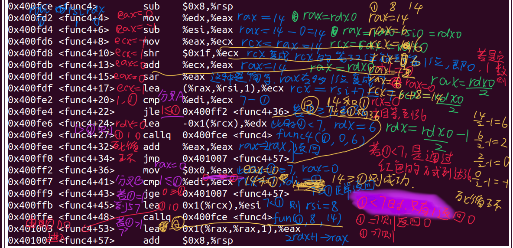

# 做bomb lab的经历和体会

通过做这个二进制的bomb，学习到了如下技能
## 1. gdb的配置和使用
`gdb -tui executable_file` :调用gdb并打开图形界面（显示代码之类的）

`layout asm`: 显示汇编代码

`layout regs`:显示寄存器

`b *address`:在特定的地址打断点,address可以是汇编的地址简写,比如main, (main+12), (func4+12),其它用法略,网上都有

`n` `next`:next line, 遇到函数就执行完,不会进入函数内部

`ni`:汇编里面的next line

`c` `continue`:运行到下一个断点

`s`: step into,遇到函数会进去

`finish`:函数里面跳出来

`x/[number][format][length] address`:显示从`address`开始的`number`个`length`长度的元素,以`format`格式展示. 

`address`:可以是寄存器里面的内容,比如`$rsp`
`format`:`x`16进制,`d`十进制
`length`:`b`:byte,`w`:4 bytes, `g`:8 bytes

`refresh`:刷新terminal的内容,有时候窗口文字花了这样就可以刷新,但是与此同时console的输出也会被刷新没了

注: gdb的汇编代码是有行号的,比如main+121,phase_6+122这种, 但是objdump就没有, 看起来比较费力


## 2.做bomb的经历和体会

### 关于汇编代码
####  阅读汇编代码的方式
- 做前几个phase 的时候, 我是把代码截图下来, 然后在iPad上批注. 我不断地按照执行顺序人工阅读代码并且人工计算,在不断的重复之中看出来代码的逻辑结构是怎样的.
- 这样对于简单的汇编还可以, 但是对于复杂的控制结构和长汇编代码就不行了. 如图, 到最后很复杂而且很乱
  
- 于是到了phase_6, 在前面的方法都失效后, 我开始把汇编代码改写成C++的形式
  
#### 高级抽象很重要
- 刚开始把汇编改写成C++的时候, 为了保持代码的正确性, 我的变量全部都是用的寄存器名字(怕弄错了), rax, rbx, rcx之类的. 但是这样其实不够浓缩和精炼. 到处都是这几个寄存器, 变量的实际意义并不明确, 难以阅读.
- 于是后来我就进一步抽象, 把这些变量赋予实际的意义, 并且大幅度修改代码的结构, 使之更像人类写出来的代码. 这样到最后就容易理解多了.

#### 总结如何阅读汇编代码
1. 第一步的时候把汇编直译成C++, 里面的变量都用寄存器名字表示. 确认无误后才能进行第二步. (注意: 寄存器里面的数据大小也要注意, 比如把xxx赋值给eax, 这里你得注意到是eax而不是rax, 因为可能会发生truncate. 这种代码一律如实记录, 而不要自作主张简化. 到第二步再简化).
   ```cpp
    ebx = r12d;
    rax = short(r12d); //sign extend
    eax = memory[A + 4 * rax];
    if (eax == memory[rbp])//第一个和第二个不能相等
        explode();
    rbx++;
    if (rbx <= 5)//jump to 65
    {
        rax=ebx;//sign extend
        eax=memory[rsp+4*rax];
        if(memory[rbp]!=rax)//限制条件：第一个和第三四五六个不能相等//jump to 81
        {
            rbx+=1;
            if(rbx<=5)//jump to 65
        }
        else 
            explode();
    }    
    else
    {
        r13 += 4;
        //jump to 32
    }


2. 在这一步, 把直译的C++代码再进行高级抽象. 把里面的循环进一步改写. 如下图所示, 基本没有寄存器名字了 (注: 和上面那个代码无关, 只是拿来举例子)

    ```cpp
    struct node
    {
        long long value;
        long long addr;
    } memory[6];
    node *user_pointer[6];
    rdx = user_pointer[1];
    user_pointer[0]->addr = rdx;
    for (int i = 2; i != 6; ++i)
        user_pointer[i - 1]->addr = user_pointer[i];
    user_pointer[5]->addr=nullptr;

    for(int i=0;i<5;++i)
    {   
        user_pointer[i]->value < user_pointer[i+1]->value;
    }


### 数据结构对于phase_6的关键作用
- 这个phase_6确实很难顶(指的是最后面的那个node部分). 一开始的时候我没看出来`0x6032d0`是一个链表的地址. (不过gdb已经指出来了啊, 我`x/3xg 0x6032d0`的时候, gdb就显示出来`<node> xxx xxx`了, 但是我没注意到这点).
- 这部分汇编代码里面反复出现的一些操作, 是`memory[addr]+8]`, `memory[memory[addr]+8]]`. 我不知道这是什么意思, 然后把这些操作全部写在纸上. 由于循环只有6次所以我都写了
出来, 试图通过这种方式来暴力求解. 但是不行.

这是我一开始的时候写出来的列表
- 最后在网上看到别人的博客, 发现几个关键词: 数据结构, node, 然后我就懂了, 这个是链表的节点. node里面有两个元素, 一个是值, 一个是下一个node的指针. 
  

### 总结
- 要读懂汇编代码, 抽象很重要. 慢慢抽象, 一步一步地把代码还原成人类易懂的结构和命名. 
- 数据结构也是一种抽象. 如果你熟悉某种数据结构, 你更有可能把汇编还原为抽象的高级语言. 就比如phase_6. 如果我看不出这是节点, 光暴力去顺序执行, 非常难, 暴力解决低层次的抽象问题很难, 不如还原成高层次的问题然后直观理解出来. 