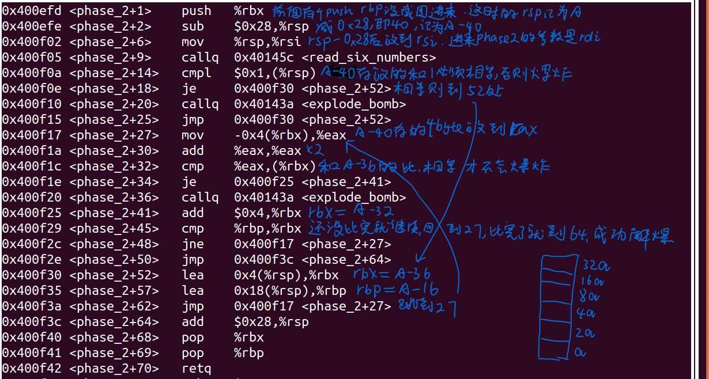
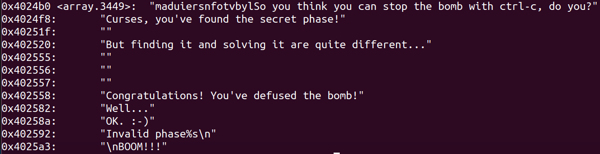

# bomb lab´ğ°¸

### °ÑÏÂÁĞÎÄ×Ö¸´ÖƵ½Ò»¸ötxtÎļş, eg answer.txt, È»ºóÔËĞĞbomb: ./bomb answer.txt, ¼´¿É³É¹¦½â±¬Õ¨µ¯
Border relations with Canada have never been better.
1 2 4 8 16 32
7 327
3 0
IONEFG
4 3 2 1 6 5

## µÚÒ»¸ö
- Õâ¸ö¾ÍÊÇÒªÄãÊäÈëÒ»´®×Ö·û, °ÑÕâ´®×Ö·ûºÍ¶ş½øÖÆÎļşÀïÃæ´¢´æµÄ×Ö·û±È½Ï.
- `sscanf`:Èı¸ö²ÎÊı, µÚÒ»¸öÊÇsource×Ö·û´®, µÚ¶ş¸öÊÇformat×Ö·û´®, µÚÈı¸öÊÇdestµÄµØÖ·. ÀıÈç`sscanf("12 32 21","%d %d %d",0x123456)` , Ç°Á½¸ö×Ö·û´®¿ÉÒÔÊÖ¶¯Ğ´, Ò²¿ÉÒÔ°Ñ×Ö·û´®µÄÊ×µØÖ·ÊäÈë.
- ÀïÃæ´¢´æµÄ×Ö·û¿ÉÒÔÕÒµ½Ê×µØÖ·ºóÔÚgdbÓà `x/`ÃüÁîÏÔʾ³öÀ´

### ´ğ°¸:¡¾Border relations with Canada have never been better.¡¿

## µÚ¶ş¸ö

Õâ¸ö¶Á6¸öÊı×Ö, È»ºóµÚÒ»¸öÊı×ÖÒªºÍ1Ïàͬ, ÆäÓàÊı×Ö¶¼ÊÇÇ°Ò»¸öÊı×ÖµÄÁ½±¶, ËùÒÔ½á¹ûÊÇÕâÑù
### ´ğ°¸:¡¾1 2 4 8 16 32¡¿

## µÚÈı¸ö
¾ßÌåÍüÁËÊÇʲôÁË, ûÓĞÁôÏÂÉî¿ÌµÄÓ¡Ïó. Ö±½Ó±©Á¦¶Á»ã±àÒ»²½Ò»²½×öµÄ.
### ´ğ°¸

¡¾0 207¡¿

¡¾1 311¡¿

¡¾2 707¡¿

¡¾3 256¡¿

¡¾4 389¡¿

¡¾5 206¡¿

¡¾6 682¡¿

¡¾7 327¡¿

## µÚËĸö
Õâ¸öphase±È½ÏÁîÈËÓ¡ÏóÉî¿Ì. ÀïÃæÓĞÒ»¸öÈı¸ö·ÖÖ§µÄµİ¹é, ʵ¼ÊÉÏÓĞÒ»¸öµİ¹éÊÇÎŞĞ§µÄ. Òò´Ë, °ÑËùÓеĽøÈëÎŞĞ§µİ¹éµÄÅųıµô, ÓĞ¿ÉÄÜ´æÔÚµÄÈ¡Öµ´úÈë³¢ÊÔ¼´¿É.
    
```cpp

    #include "stdio.h"
    short rdi, rsi, rdx, rcx, rax;
    void func4()
    {
        if (rdx < rsi)
            rcx = (rdx - rsi + 1) / 2 + rsi;
        else
            rcx = (rdx - rsi) / 2 + rsi;
        if (rcx == rdi)
        {
            rax = 0;
            return;
        }
        if (rcx < rdi)//½øÈëÕâ¸öÑ­»·¾ÍûϷÁË£¬·µ»ØÖµ±ØÈ»²»¿ÉÄÜÊÇ0. Èç¹ûÕâ¸öµİ¹éÀïÃæ·µ»ØµÄ²»ÊÇ0, ËùÓеĵݹé½áÊøºó±ØÈ»rax²»ÊÇ0
        {
            rsi = rcx + 1;
            func4();
            rax = 2 * rax + 1;
            return;
        }
        if (rcx > rdi)
        {
            rdx = rcx - 1;
            func4();
            rax *= 2;
            return;
        }
    }

    int main()
    {
        int x;
        x = 2;
        rdi = x;
        rsi = 0;
        rdx = 14;
        func4();
        printf("%d\n", rax);
        return 0;
    }
```

### ´ğ°¸
¡¾7 0¡¿

¡¾1 0¡¿

¡¾3 0¡¿

¡¾0 0¡¿

## µÚÎå¸ö
- Ä¿±ê×Ö·û´®ÊÇflyers, ASCIIÂë(decimal)Ϊ:102 108 121 101 114 115
Õâ¸öÊÇÔÚ³ÌĞò´úÂëÀïÃæ´æÁËÒ»¸öflyers×Ö·û´®ÓÃÀ´¶Ô±È, È»ºóÓĞÒ»¸öµØÖ·¸øÄã, ¼ÇΪaddr. ÄãÊäÈëµÄ6¸ö×Ö·ûµÄASCII+addr×÷ΪaddrNew, °Ñ´ÓaddrNew¶ÁÈ¡µÄ×Ö·ûºÍflyersÀïÃæµÄ×Ö·û¶Ô±È, Ò»Ñù²ÅĞĞ. ËùÒÔÒ²¾ÍÊÇ˵Õâ¸öphaseµÄºËĞÄÊÇ×¢Òâµ½addr
- Õâ¸öÌâÒ»¿ªÊ¼µÄʱºòÎÒÔÚaddr´ú±íµÄ×Ö·û´®ÀïÃæÑ¡µÄλÖö¼ÊÇ¿¿Ç°µÄ, È»ºóÓÿ¿Ç°µÄ×ÖĸµÄÔÚaddr×Ö·ûÊı×éÀïµÄĞòºÅ×÷ΪÊäÈë×Ö·û´®µÄASCIIÂë,
  ½á¹ûÊÇÒ»¶ÑÎŞ·¨ÏÔʾµÄ×Ö·û´®.
- ºóÀ´ÎÒÍùºóÃæÕÒ, ÊÔͼʹÓÃÄÇĞ©Äܹ»´òÓ¡µÄĞòºÅÀ´×÷Ϊ´ğ°¸, µ«ÊÇ·¢ÏÖʧ°ÜÁË, Õ¨µ¯±¬Õ¨
- ÔÚÍøÉϲéÁ˲é, ÓÖ¼ì²éÁËÏÂ×Ô¼ºµÄ´úÂë, ²Å·¢ÏÖÊäÈëµÄ×Ö·û´®µÄASCIIÂëÖ»ÓĞ×îºóÃæµÄ4 bits±»Ê¹ÓÃÁË. ËùÒÔÓû§ÊäÈëµÄ×Ö·û´®µÄASCIIÖ»ÓĞÔÚ15Ö®ÄڲŻáÓĞЧ. »òÕßÓÃÄÇĞ©lower 4 bitsºÍµÚÒ»¸ö´ğ°¸µÄASCIIÒ»ÑùµÄÒ²¿ÉÒÔ.
  

ÕâÊÇaddr´¦µÄ×Ö·û´®

### ´ğ°¸:
¡¾	¡¿(ÎŞ·¨ÏÔʾµÄASCII) 

ASCII·Ö±ğÊÇ09 0f 0e 05 06 07

°ÑÇ°4¸öbit¸Ä³É4, ´Ó¶øµÃµ½¿ÉÏÔʾ×Ö·û, ´ğ°¸2:

¡¾IONEFG¡¿

ÆäÓ໹Óкܶà, ¾Í²»Ò»Ò»Áгö

## µÚÁù¸ö

Õâ¸ö´úÂëµÄ¹ı³ÌÊÇ, ÏȶÁÈë6¸öÊı×Ö
1. Õâ6¸öÊı×Ö¶¼ÒªĞ¡ÓÚµÈÓÚ6
2. Õâ6¸öÊı×Ö²»ÄÜÏàµÈ
3. Õâ6¸öÊı×Ö±ä³É7-self
4. `0x6032d0`ÊǵÚÒ»¸önodeµÄµØÖ·, ÕâĞ©node¶¼ÊÇ´æ·ÅÒ»¸ö64bitÖµ(`value`), È»ºóÊÇÒ»¸ö64bitµØÖ·(`next`), Ö¸ÏòÏÂÒ»¸önode. 6¸önodeÔÚÄÚ´æÀïÃæÊÇ˳Ğò½ô°¤×Å´æ·ÅµÄ, ·Ö±ğ¼ÇΪnode_1µ½6.
5. ¸Ä±äºóµÄ6¸öÊı×Ö, ÆäÖеÚi¸öÊı×ÖÊÇj,ÄÇô¾Í°Ñnode_j·Åµ½Ò»¸ö6ÔªËØÖ¸ÕëÊı×éµÄµÚi¸öλÖÃ. (ÓÉ´Ë¿ÉÒÔ¿´³öÊı×ÖÖ»ÄÜÔÚ1-6ÀïÃæÑ¡)
6. ¼ÙÉèÖ¸ÕëÊı×éÀïÃæµÄnodeµÄ˳ĞòÊÇnode_i1µ½i6, È»ºóÁí`node_i1->next = node_i2`, `node_i2 -> next = node_i3`, etc, °ÑÕâÁù¸ö°´ÕÕÔÚÖ¸ÕëÊı×éÀïÃæµÄÎïÀíµÄλÖÃ˳Ğò, Á¬½ÓÆğÀ´
7. ÒªÇó`node_i1 -> value > node_i2 -> value`, ÒÔ´ËÀàÍÆ. ΪÁËʵÏÖÕâÒ»µã, ¸Ä±ä6¸öÊı×ÖµÄÊäÈë˳Ğò¼´¿É.

### ´ğ°¸
¡¾4 3 2 1 6 5¡¿

